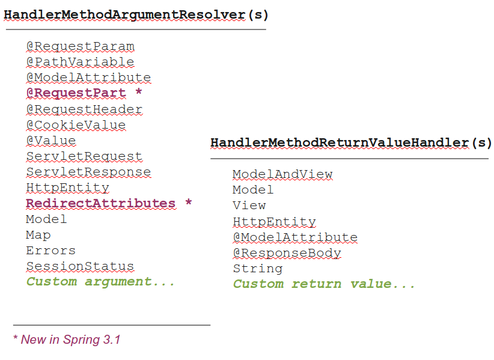

!SLIDE subsection
# @MVC Infrastructure

!SLIDE incremental bullets
# @MVC

* Introduced in Spring 2.5
* Expanded for REST in Spring 3.0
* Overall very successful
* Does more
* More flexible, etc.

!SLIDE incremental bullets
# @MVC Infrastructure

* We're talking about...
* `DefaultAnnotaionHandlerMapping`
* `AnnotationMethodHandlerAdapter`
* `AnnotationMethodHandlerExceptionResolver`

!SLIDE incremental bullets
# @MVC Infrastructure

* Replaced controller class hierarchy
* Not as easy to customize
* _Search JIRA for above class names!_
* Some legacy quirks

.notes No concept of selecting a method (rather than a controller) resulting in duplicated handler method selection, inability to split HTTP methods across controllers, etc.

!SLIDE incremental bullets
# New @MVC Infrastructure
## (Spring 3.1)

* `RequestMappingHandlerMapping`
* `RequestMappingHandlerAdapter`
* `ExceptionHandlerExceptionResolver`

!SLIDE incremental bullets
# I.e.

* __`@RequestMapping`__ `HandlerMapping`
* __`@RequestMapping`__ `HandlerAdapter`
* __`@ExceptionHandler`__ `ExceptionResolver`

!SLIDE incremental bullets
# New Abstractions

* `HandlerMethod`
* `HandlerMethodArgumentResolver`
* `HandlerMethodReturnValueHandler`

!SLIDE incremental bullets
# What Is Possible Now

* Select a controller method
* Customize all argument types
* And all return values

!SLIDE center

!SLIDE center

!SLIDE incremental bullets
# __HandlerMapping__ Customizations

* Provide custom `RequestCondition`
* Build `RequestMappingInfo` from
* ... custom annotations
* ... or anything else

!SLIDE incremental bullets
# __HandlerAdapter__ Customizations

* Plug custom argument & return values
* Extend built-in arguments & return values
* Design your own method signature

!SLIDE incremental bullets
# Configuration

* __New__ support classes are "on"
* ... if using MVC namespace, Java config
* __Old__ support classes are "on"
* ... with out-of-the-box defaults

.notes Use of namespace is by choice and represents the recommended configuration

!SLIDE incremental bullets
# That Means...

* With MVC namespace you're automatically using the new classes
* For explicit config you need to switch to the new classes

!SLIDE
# Demo 

<a href="https://github.com/rstoyanchev/spring-mvc-31-demo">__https://github.com/rstoyanchev/spring-mvc-31-demo__</a>

!SLIDE incremental bullets
* For the Remaining Slides We Assume 
* New Infrastructure Is In Use!

