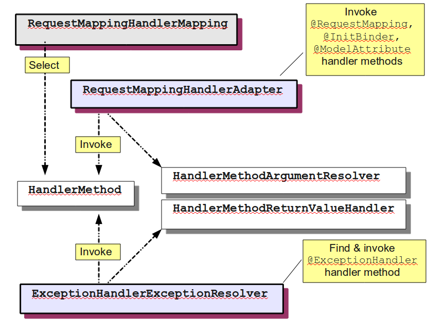

!SLIDE subsection
# @MVC Infrastructure

!SLIDE incremental bullets
# @MVC

* Introduced in Spring 2.5
* Expanded for REST in Spring 3.0
* Overall very successful
* Does more
* More flexible

!SLIDE incremental bullets
# What Is The
# @MVC Infrastructure?

* `DefaultAnnotationHandlerMapping`
* `AnnotationMethodHandlerAdapter`
* `AnnotationMethodHandlerExceptionResolver`

!SLIDE incremental bullets
# About The @MVC Infrastructure

* Replaced controller class hierarchy
* Not very customizable
* Some legacy quirks

.notes No concept of selecting a method (rather than a controller) resulting in duplicated handler method selection, inability to split HTTP methods across controllers, etc.

!SLIDE incremental bullets
# The New 
# @MVC Infrastructure

* `RequestMappingHandlerMapping`
* `RequestMappingHandlerAdapter`
* `ExceptionHandlerExceptionResolver`

!SLIDE incremental bullets
# Named after..

* __`@RequestMapping`__ `HandlerMapping`
* __`@RequestMapping`__ `HandlerAdapter`
* __`@ExceptionHandler`__ `ExceptionResolver`

!SLIDE center

!SLIDE incremental bullets
# New Abstractions

* `HandlerMethod`
* `HandlerMethodArgumentResolver`
* `HandlerMethodReturnValueHandler`

!SLIDE incremental bullets
# What Is Possible Now

* Custom request conditions
* Build request mappings from any source
* Inspect controller method in interceptors
* Customize any argument or return value
* Design own method signature

!SLIDE
# Demo 

<a href="https://github.com/rstoyanchev/spring-mvc-31-demo">__https://github.com/rstoyanchev/spring-mvc-31-demo__</a>

!SLIDE incremental bullets
# Configuration

* __New__ infrastructure classes are "on" if using MVC namespace or Java config
* __Old__ infrastructure classes still available but no new features
* Remaining slides assume new infrastructure classes

